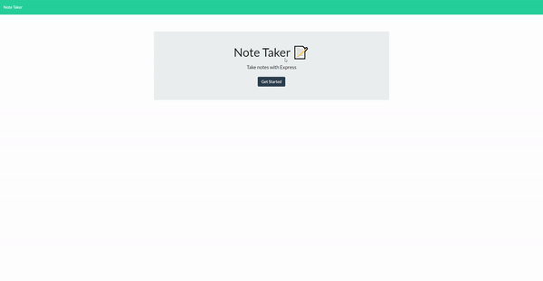

# Note-Taker

## Table of Contents
  * [License](#license)
  * [Description](#description)
  * [Demo](#demo)
  * [Technologies](#technologies)
  * [Links](#links)

## License

## Description
The purpose of this application is to allow users to save notes.
Upon first loading the page, 2 fields will be availabe to input a title and the text for the note.
Users are allowed to save their notes in columns, and select back to read them over.
Upon refreshing the page, the recent saved notes will be there and users can click to delete them.

## Demo

 
## Technologies
- CSS
- HTML
- Javascript
- Node.js

## Links
* Heroku Live Deployment: (https://kenpet-note-taker.herokuapp.com/)
* Github Repository URL: (https://github.com/KPetiote/Note-Taker)