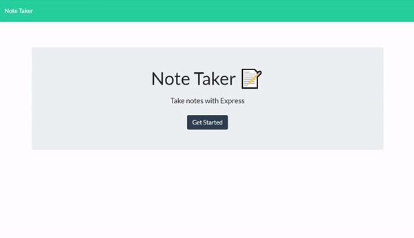

# Note-Taker
## Table of Contents
  * [License](#license)
  * [Description](#description)
  * [Demo](#demo)
  * [Technologies](#technologies)
  * [Links](#links)

## License

## Description
The purpose of this application is to allow users to save notes.
Users are allowed to get the application started and save their notes in columns.
Upon first loading the page 2 fiels will be availabe to input a title and the text for the note.
Upon refreshing the page, the recent saved notes will be there and users can click to delete them.

## Demo

 
## Technologies
- CSS
- HTML
- Javascript
- Node.js

## Links
* Heroku Live Deployment: (https://kenpet-note-taker.herokuapp.com/)
* Github Repository URL: (https://github.com/KPetiote/Note-Taker)